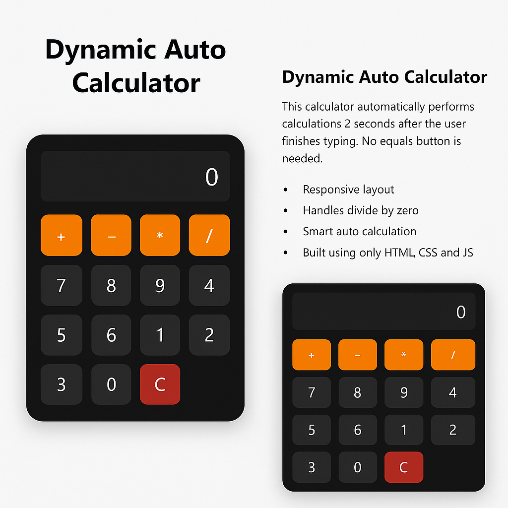

# 🔢 Dynamic Auto Calculator

An intelligent, fully responsive calculator that auto-calculates results **after 2 seconds of inactivity** — **no "=" button required**! Built using only **HTML, CSS, and JavaScript**, this project blends modern UI/UX principles with real-time dynamic logic.

---

## 📱💻 Responsive by Design

- ✅ **Mobile View** – Clean, centered calculator with minimal distractions
- ✅ **Desktop View** – Elegant 2-column layout with feature highlights and user instructions

---

## 🚀 Key Features

- ⏱️ **Auto Calculation**  
  Results are automatically calculated 2 seconds after the user finishes typing. No need for an equals button!

- 📱 **Mobile-First Layout**  
  Optimized for smartphones and tablets with smooth, centered UI.

- 💻 **Enhanced Desktop UX**  
  Informative left panel, visually balanced layout, and polished design.

- 🧠 **Smart Input Handling**  
  Prevents invalid inputs like double operators and divide-by-zero errors.

- 🎯 **Lightweight & Fast**  
  No frameworks. Just clean vanilla HTML, CSS, and JavaScript.

---

## ✨ Live Preview (Optional)

> Coming soon: [Click to View Online](#)  
*(If hosted on GitHub Pages or Netlify, add your link here)*

---

## 🛠️ How to Use

1. Clone or download this repository.
2. Open the `index.html` file in any browser.
3. Start clicking buttons — the calculator updates live!
4. Results appear automatically after 2 seconds of pause.

---

## 🔧 Tech Stack

- HTML5
- CSS3 (Media Queries for responsive design)
- JavaScript (DOM, Events, Timeout, Eval)

---

## 📸 Screenshots

### 💻 Desktop View

### 📱 Mobile View

> *(Add your own screenshots in a folder called `/screenshots` to activate this section)*

---

## 🧑‍💻 Author

**Zk** — *HTML, CSS, and JavaScript enthusiast with a focus on clean UI/UX and dynamic logic design.*

---

## 📢 License

MIT License. Free to use, modify, and share!

---

> If you like this project, feel free to ⭐ star it and share it with others!

---

## 📂 File Structure

